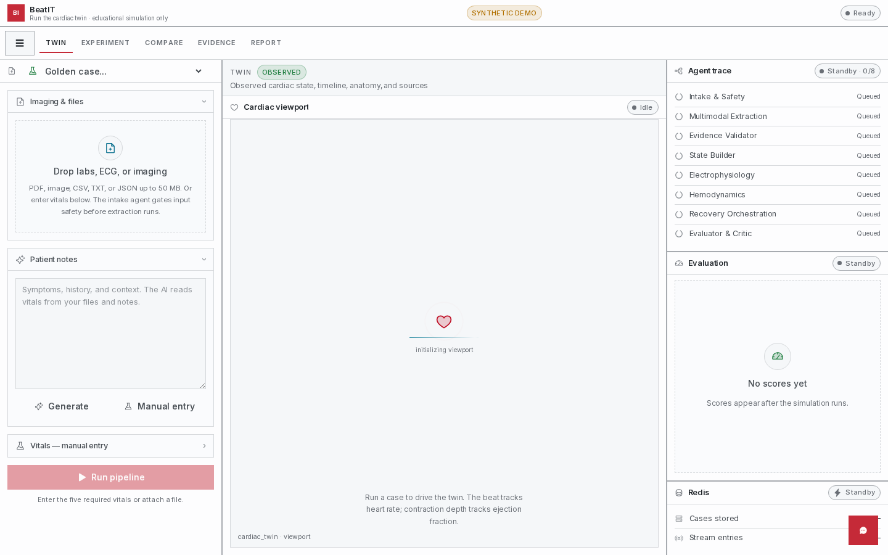
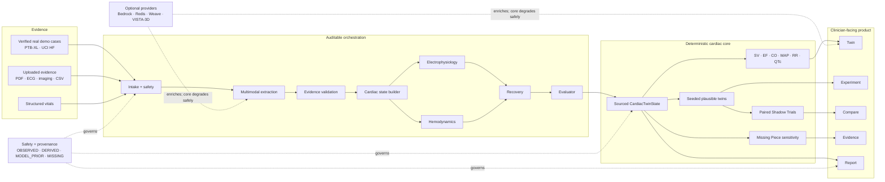
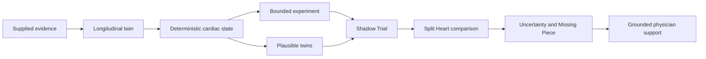
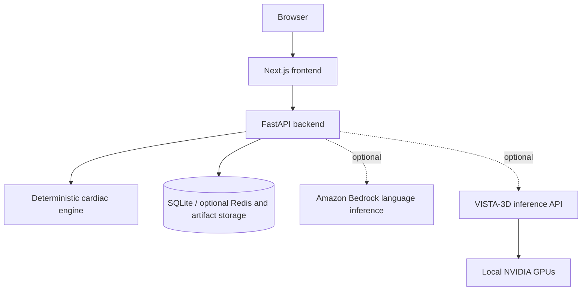

# BeatIT

### Evidence → physiology → experiment → uncertainty

**BeatIT turns cardiac evidence into an auditable computational twin that a
clinician or researcher can inspect, experiment on, compare, and question.**

**Not another medical chatbot. The cardiac engine establishes the physiology;
AI may explain and interrogate it.**

[](https://www.python.org/)
[](https://fastapi.tiangolo.com/)
[](https://nextjs.org/)
[](https://www.typescriptlang.org/)
[](#verified-aws-status)

**AWS-integrated with verified Bedrock inference.**

> **Research and clinician-supervised education only.** BeatIT is not a medical
> device, diagnostic system, treatment recommender, emergency service, or
> validated patient-outcome predictor.



*A real local application capture. The empty viewport is honest: this screen
was captured before a case run, while the synthetic-demo workflow was ready.*

## Five-slide demo deck

**[Download the formal BeatIT presentation (PPTX)](PPT/BeatIT_5_Slide_Demo.pptx)**

The five-slide deck is designed for a concise, demo-first presentation:

1. BeatIT's evidence-first thesis
2. The clinical communication and trust gap
3. The eight-agent deterministic workflow
4. Independent PTB-XL ECG and UCI heart-failure demo cases
5. Validation, differentiation, and the closing message

The presentation is editable and reproducible. Regenerate it with:

```bash
python scripts/create_demo_ppt.py
```

> **Demo integrity:** synthetic measurements = 0; cross-patient stitching = 0;
> missing modalities remain explicitly missing.

## Built for the Healthcare AI Hackathon

BeatIT is being presented for the **Healthcare AI Hackathon** on
**September 26, 2026**, hosted at the **AWS Builder Loft in San Francisco**.
The event brings together clinicians, engineers, researchers, founders, and
investors to build products with meaningful real-world healthcare impact.

Presented by **Pear VC, NEA, and Cathay Innovation**, and powered by
**OpenAI, AWS, J.P. Morgan, and Troutman Pepper**, the hackathon emphasizes
new healthcare capabilities—not incremental AI wrappers. BeatIT addresses that
brief with an inspectable cardiac evidence model, deterministic physiology,
multi-agent orchestration, and explicit uncertainty.

**Hackathon demonstration:**

- Load an independent, verified PTB-XL ECG or UCI heart-failure case.
- Inspect what is observed, derived, modeled, and missing.
- Watch specialist agents construct and evaluate the cardiac twin.
- Run bounded computational scenarios without presenting them as treatment.
- Trace every displayed value back to evidence, formula, or labeled prior.

> BeatIT is a research and educational prototype. It is not a diagnostic,
> treatment, triage, or clinical decision-making system.

## Current product architecture



The diagram reflects the current repository architecture. Optional providers
may enrich extraction, persistence, tracing, language, or segmentation, but
they are not numerical authorities and the deterministic core remains usable
when they are unavailable.

## Why BeatIT?

Cardiac evidence arrives as ECGs, imaging, vitals, laboratory results,
medication histories, clinical notes, and longitudinal events. These sources
are useful individually, but their provenance, timing, and uncertainty are hard
to carry into one inspectable physiological representation.

Electronic records primarily preserve facts and workflow. Language models are
good at language and retrieval but are unsafe numerical authorities for
patient-specific physiology. Mechanistic simulation provides mathematical
structure but is often separated from clinical evidence and interaction.
BeatIT is an engineering attempt to join those layers while keeping their
authority boundaries visible:

```text
evidence → sourced state → deterministic physiology → bounded simulation
         → paired comparison → uncertainty analysis → grounded explanation
```

Cardiovascular disease remains a major global burden, but this repository does
not turn that burden into a claim of clinical efficacy or market adoption. See
[Problem](docs/product/PROBLEM.md) and
[Market gap](docs/product/MARKET_GAP.md) for sourced context.

### Conceptual positioning

This is a category-level description, not an exhaustive comparison of every
vendor or research platform.

| Approach | Records and workflow | Language interaction | Mechanistic physiology | Counterfactual experiments | Explicit uncertainty and provenance |
|---|---:|---:|---:|---:|---:|
| Electronic health record | Strong | Product-dependent | Usually not its purpose | Usually not its purpose | Source history varies |
| General language model | Context-dependent | Strong | Unreliable as numerical authority | Generative rather than mechanistic | Variable |
| Cardiac simulation research | Input-dependent | Usually limited | Strong within model scope | Strong within model scope | Method-dependent |
| BeatIT research prototype | Normalized evidence model | Optional | Deterministic, bounded engine | Paired computational scenarios | First-class product concepts |

BeatIT does not claim to replace any of these categories. It tests whether a
clinician-facing workflow can connect their useful parts without erasing the
differences between evidence, model assumptions, simulation, and prose.

## What BeatIT does

| Space | Question | Implemented behavior |
|---|---|---|
| **Twin** | What evidence and modeled state are present? | Longitudinal snapshots, semantic heart, ECG/PV context, provenance |
| **Experiment** | How does a bounded hypothetical input affect the model? | Immutable baseline, validated parameters, deterministic propagation |
| **Compare** | What changed? | Same-sample baseline/counterfactual pairing and Split Heart |
| **Evidence** | Why is the result uncertain? | Sensitivity, uncertainty drivers, evidence-priority heuristics |
| **Report** | How do the pieces fit together? | Summary with assumptions, provenance, and limitations |

Optional providers can enrich this path, but the deterministic baseline and
scenario workflow remains available when language, tracing, memory, or imaging
providers are unavailable.

## Signature workflow



### Split Heart

Split Heart displays one plausible twin before and after the same bounded
scenario. Selection can be linked across both hearts, and the comparison clock
can show synchronized phase or physiological-rate context. Metric deltas come
from backend computation.

```text
BASELINE                    COUNTERFACTUAL
same sample                 same sample + bounded scenario
     ♥                              ♥
EF / SV / CO                 EF / SV / CO
              deterministic Δ
```

The geometry is a procedural semantic visualization, not a patient-specific
biomechanical reconstruction. A visual difference is not an outcome forecast.

### Probabilistic Twin

BeatIT represents selected uncertain inputs as explicit bounded distributions,
samples them with a recorded seed, rejects invalid samples, and runs every
accepted sample through the same deterministic physiology:

```text
one evidence set → uncertain modeled inputs → seeded plausible twins
```

The resulting percentiles describe accepted simulations. They are not clinical
confidence intervals, disease probabilities, or patient risks.

### Shadow Trial

Shadow Trial applies one scenario to every stored plausible twin and compares
each twin only with its own descendant:

```text
twin 1 baseline → twin 1 scenario
twin 2 baseline → twin 2 scenario
twin 3 baseline → twin 3 scenario
```

**Shadow Trial is BeatIT's name for a paired computational counterfactual
experiment. It is not a clinical trial.**

### Missing Piece

Missing Piece asks which uncertain inputs move a selected model output and
which evidence categories could constrain those inputs. Its rankings are
deterministic sensitivity and evidence-mapping heuristics. They do not instruct
a clinician to order a test or estimate the clinical benefit of doing so.

## Deterministic computation and AI

| Function | Authority |
|---|---|
| SV, EF, CO, MAP, RR, QTc, BSA | Python deterministic tools |
| Pressure-volume and recovery trajectories | Python deterministic tools |
| Cardiac and comparison clocks | BeatIT runtime |
| Scenario validation and propagation | BeatIT scenario engine |
| Plausible-twin sampling | Seeded BeatIT ensemble engine |
| Shadow Trial pairing and deltas | BeatIT backend |
| Sensitivity and evidence ranking | BeatIT Missing Piece engine |
| Image segmentation | Optional external VISTA-3D |
| Tool routing | Deterministic registry; optional Laya integration |
| Explanation and synthesis | Optional provider-neutral language layer |

The assistant is one interface over a canonical tool registry. Tools establish
facts; a configured model may explain them. Output validation and safety
boundaries remain active, and no model response may overwrite canonical
physiology. See [AI boundary](docs/architecture/AI_BOUNDARY.md).

<details>
<summary>Canonical formulas</summary>

```text
SV  = EDV - ESV
EF  = SV / EDV × 100
CO  = HR × SV / 1000
MAP = DBP + (SBP - DBP) / 3
RR  = 60000 / HR
QTc = QT / sqrt(RR seconds)
BSA = sqrt(height × weight / 3600)
```

Implementations and versioned assumptions—not this README—are authoritative.

</details>

## Architecture truth



### What is actually deployed

#### Verified AWS status

| AWS service | BeatIT status | Verified evidence |
|---|---|---|
| Amazon Bedrock | **Runtime smoke verified** | Model discovery and one minimal inference succeeded in `us-east-1`; optional and never a numerical authority |
| Amazon CloudWatch Logs | **Probe verified; no BeatIT log group deployed** | Account read probe succeeded |
| Amazon S3 | **Adapter implemented; not deployed** | Workshop IAM denied bucket discovery; no BeatIT bucket or upload exists |
| Amazon ECR | **Not deployed** | Workshop IAM denied repository discovery |
| Amazon ECS / Fargate | **Not deployed** | Workshop IAM denied cluster discovery |
| AWS App Runner | **Not deployed** | Workshop IAM denied service discovery |
| AWS Amplify Hosting | **Not deployed** | Workshop IAM denied application discovery |
| Amazon EC2 | **Not deployed** | Workshop IAM denied instance discovery |
| AWS Lambda | **Not deployed** | Workshop IAM denied function discovery |
| Amazon Lightsail | **Not deployed** | Workshop IAM denied instance discovery |
| AWS Secrets Manager | **Not deployed** | Workshop IAM denied secret discovery |
| AWS Systems Manager Parameter Store | **Not deployed** | Workshop IAM denied parameter discovery |
| AWS CloudFormation | **Not deployed** | Workshop IAM denied stack discovery |
| Amazon RDS | **Not selected or deployed** | Current local experiment persistence uses SQLite |

**AWS application hosting status: not deployed.** The authenticated workshop
role permits Bedrock inference and limited CloudWatch access but does not grant
the hosting, registry, storage, or secret permissions required to deploy
BeatIT. The audit found zero BeatIT AWS resources and zero AWS public URLs.

- **Vercel:** a `beatit` project and GitHub connection exist, but the first
  deployment failed because of an incorrect root-directory combination. No
  working Vercel frontend is claimed.
- **Cloudflare Tunnel:** a temporary Quick Tunnel currently exposes only the
  loopback-bound BeatIT backend. It runs detached; its generated hostname is
  ignored runtime state, not a durable deployment.
- **VISTA-3D:** the API and two GPU workers run detached. A fresh automatic
  segmentation completed on GPU 0 in 0.257 seconds. Its current API process
  lacks endpoint authentication, so it is deliberately not tunneled directly.

These statements distinguish code capability from deployed infrastructure. See
[AWS architecture](docs/architecture/AWS.md) and
[AWS service inventory](docs/architecture/AWS_SERVICE_INVENTORY.md).

## Data and provenance

- **Synthetic demo fixtures:** the safe default for public demonstrations.
- **Open real datasets:** adapters/local artifacts for PTB-XL, UCI Heart
  Failure Clinical Records, and selected imaging research sources, subject to
  their licenses.
- **Restricted/private sources:** excluded from public deployment unless a
  documented agreement and security review permit use.

Different datasets are never represented as one real patient. A composite
software-testing case remains explicitly labeled as composite. Missing evidence
is not interpreted as normal.

Every displayed value should retain one of these statuses:
`measured`, `extracted`, `derived`, `inferred`, `default_model_prior`, or
`simulated`. Derived values identify their formula; simulations identify their
scenario and model version.

```text
displayed value → derivation/status → evidence reference → source
```

More supplied evidence may constrain modeled inputs. Less evidence produces
more prior-filled or unavailable state and should increase visible uncertainty;
it must never manufacture completeness.

### Input contract and graceful degradation

A useful full case may include patient basics, vitals, a 12-lead ECG, echo
measurements, and clinical context. The software can accept narrower evidence,
but it must label what is absent. PTB-XL contributes real ECG evidence without
invented echo or vitals; UCI Heart Failure contributes tabular clinical
variables without pretending to contain raw ECG or imaging.

```text
more relevant evidence → fewer unconstrained modeled inputs
less relevant evidence → wider or unavailable modeled state → Missing Piece
```

That relationship is a modeling principle, not a promise that every additional
test improves clinical decisions. Missing Piece ranks evidence categories that
could constrain the implemented model; it does not prescribe testing.

## How the 3D heart works

The client uses React Three Fiber and Three.js to render a procedural,
anatomically suggestive heart. A semantic component registry supports
selection, findings, component inspection, and linked comparison. A shared
cardiac clock drives beat phase and electrical context.

VISTA-3D is a separate optional segmentation boundary. It can return a CT label
map and metadata; deterministic Python code derives supported volumetric
quantities. The current VISTA heart label is whole-heart, not chamber-specific,
so BeatIT does not claim CT-derived chamber mechanics.

## Repository map

```text
BeatIT/
├── api/                    # deployment entry point
├── python/hearttwin/       # API, deterministic engines, assistant, storage
├── web/                    # Next.js UI and five product spaces
├── fixtures/               # synthetic and golden verification inputs
├── data/                   # governed local datasets and generated artifacts
├── scripts/                # smoke, release, data, and model checks
├── deploy/                 # local launcher and proxy guidance
└── docs/                   # architecture, product, credibility, demo, release
```

Machine-readable inventories:
[system](docs/architecture/system-manifest.json),
[AWS](docs/architecture/aws-manifest.json), and
[tooling](docs/architecture/tooling-manifest.json).

## Technology stack

Only technologies represented in the audited source or runtime evidence are
listed here.

- **Frontend:** Next.js 16, React 19, TypeScript, Zustand, Three.js, React Three
  Fiber, React Three Drei, and Zod.
- **Backend:** Python 3.13, FastAPI, Pydantic, NumPy, SciPy, and Uvicorn.
- **Cardiac computation:** internal modules for cardiac state, hemodynamics,
  recovery simulation, scenarios, ensembles, paired Shadow Trials, and Missing
  Piece sensitivity.
- **Data and persistence:** FHIR-shaped normalization, JSON artifacts, SQLite
  experiment stores, plus optional Redis and S3 adapters.
- **Optional intelligence:** provider-neutral language adapters, Amazon Bedrock
  paths, Laya routing with deterministic fallback, and VISTA-3D segmentation.
- **Operations:** Docker/local process scripts, Vercel configuration, AWS CLI
  audit artifacts, and Cloudflare Tunnel scripts. Their presence does not imply
  a successful deployment.

Exact versions and status are recorded in
[tooling-manifest.json](docs/architecture/tooling-manifest.json) and
[THIRD_PARTY.md](THIRD_PARTY.md).

## Quick start

Requirements: Python 3.13, Node.js 22+, and pnpm.

```bash
git clone https://github.com/chetas1208/BeatIT.git
cd BeatIT
cp .env.example .env

# Backend
python -m pip install -r requirements.txt
python -m uvicorn api.index:app --reload --port 8000

# Frontend, in another shell
cd web
pnpm install --ignore-workspace
NEXT_PUBLIC_API_BASE=http://localhost:8000/api/v1 pnpm dev
```

Open `http://localhost:3000`. Secrets belong only in ignored local environment
files or a deployment secret store; never expose them through `NEXT_PUBLIC_*`.

```bash
curl http://localhost:8000/api/v1/system-check
```

Production-style local fallback:

```bash
./scripts/demo-preflight.sh
./deploy/beatit up
./deploy/beatit status
```

## Testing

```bash
pnpm test:py
pnpm -C web exec tsc --noEmit
pnpm -C web lint
pnpm -C web build
python scripts/run_local_smoke.py
./scripts/verify-release.sh --deep
```

Test counts are intentionally not hard-coded. See [testing](docs/testing.md).

## 90-second demo

1. Load the labeled synthetic case in **Twin** and inspect provenance.
2. Scrub the timeline and select an anatomical component.
3. Change one bounded parameter in **Experiment**.
4. Generate plausible twins and run a paired **Shadow Trial**.
5. Open **Split Heart** to compare the same twin before and after.
6. Ask **Missing Piece** what drives uncertainty and show its limitations.
7. Finish in **Report** with assumptions, provenance, and the safety boundary.

See [the full demo script](docs/demo/DEMO_SCRIPT.md).

## Safety and regulatory boundary

BeatIT is not currently claimed to be FDA-cleared, FDA-approved, clinically
validated, HIPAA-ready, an autonomous diagnostic system, a treatment selector,
or a substitute for professional judgment. It does not provide emergency
triage.

A clinical deployment would require authentication, authorization, tenant
isolation, encryption, retention/deletion controls, audit logs, governed data
agreements, validated integration, cybersecurity review, human-factors work,
and regulatory assessment tied to intended use and claims. See
[Safety boundary](docs/product/SAFETY_BOUNDARY.md).

## Current limitations

- Computational credibility tests are not clinical validation.
- AWS/Vercel deployment is incomplete; the current public backend bridge is an
  ephemeral Cloudflare Quick Tunnel whose hostname changes on restart.
- CopilotKit was removed from the active frontend after its runtime discovery
  blocked the core workflow. Laya routing and deterministic assistant paths
  remain backend capabilities.
- Process-local case state is not durable without a configured provider.
- SQLite is restart-safe on one host, not a hosted multi-worker database.
- Procedural heart geometry is explanatory, not patient-specific mechanics.
- VISTA availability and its whole-heart label limit imaging claims.
- Plausible-twin distributions depend on declared input assumptions and do not
  model validated joint patient distributions.
- Browser, accessibility, public TLS, and backup/restore evidence remain release
  gates where the corresponding reports say so.

## Roadmap

- **Now:** close provenance, scenario-contract, safety, and deployed-demo gates.
- **Next:** clinician workflow feedback and governed de-identified pilot
  infrastructure.
- **Later:** validated integrations and prospective evaluation appropriate to a
  deliberately reviewed intended use.

## Contributing

Read [AGENTS.md](AGENTS.md) and claim work in [docs/TASKS.md](docs/TASKS.md).
Canonical formula changes require explicit review and new golden evidence. New
behavior needs focused tests. Never commit secrets, raw restricted data, model
weights, generated builds, or unsupported medical claims.

## Research, software, and data attribution

Research references are organized in
[docs/research/REFERENCES.md](docs/research/REFERENCES.md). Open-source software,
models, and datasets are listed in [THIRD_PARTY.md](THIRD_PARTY.md) and
[data/LICENSES.md](data/LICENSES.md).

No repository-level software license is currently present. Until maintainers add
one, the source is publicly visible but must not be described as licensed for
unrestricted reuse.
