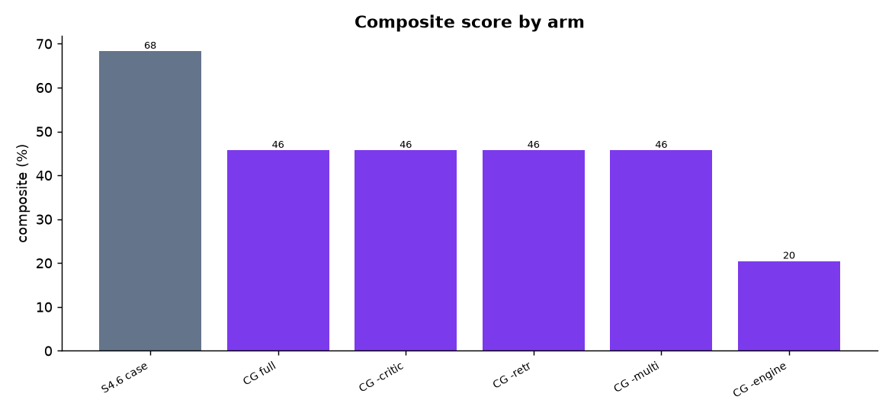
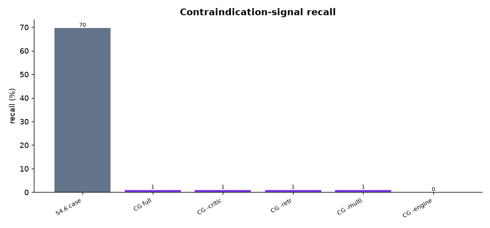
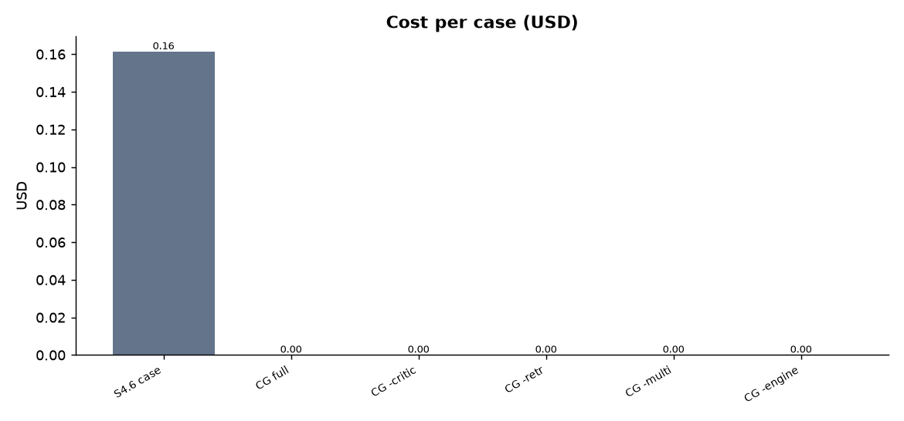
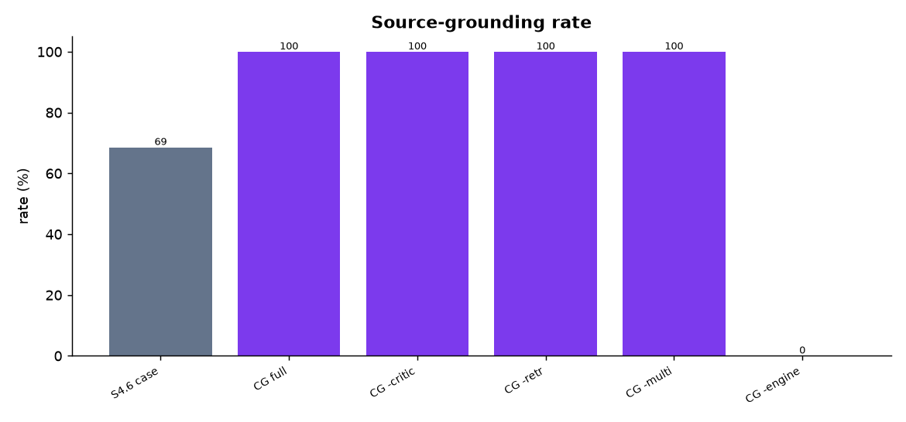
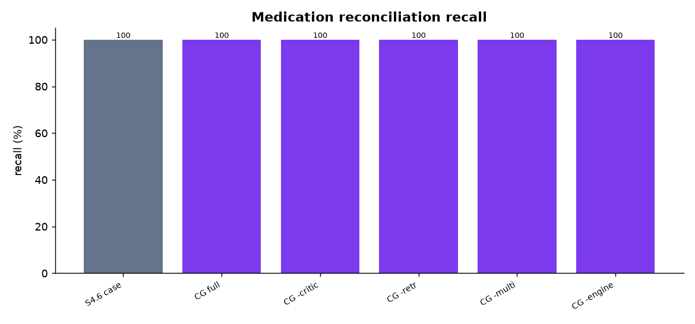
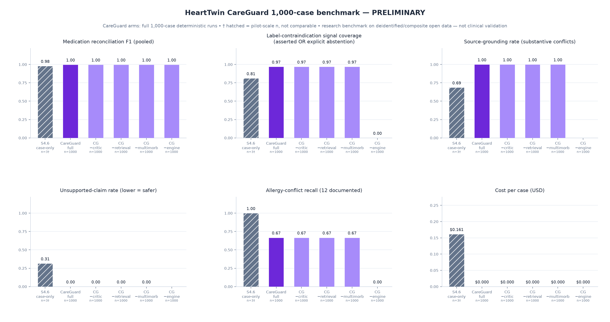
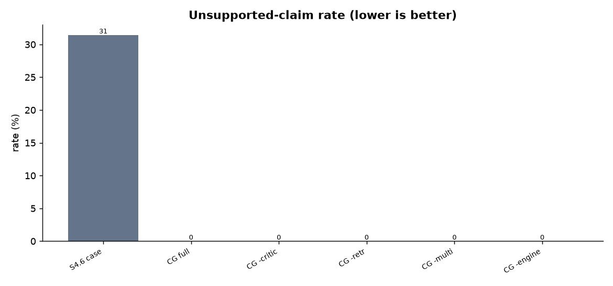

# HeartTwin CareGuard — 1,000-Case Benchmark

*Generated 2026-07-19 01:30 UTC*

> Research benchmark using deidentified, synthetic, or composite open-data cases. Not a clinical-validation study and not for diagnosis or treatment decisions. Where a case links a PTB-XL ECG to an eICU record, the ECG and EHR originate from different deidentified individuals and are combined only for multimodal software testing.

## Model verification

| arm key | model id | available | display |
|---|---|---|---|
| sonnet_45 | `claude-sonnet-4-5-20250929` | yes | Claude Sonnet 4.5 |
| sonnet_46 | `claude-sonnet-4-6` | yes | Claude Sonnet 4.6 |

Cases indexed: **1000** (eligible for run: 1000; with medication label evidence: 978).

## Primary metrics by arm (silver reference set)

| arm | n | med recall | contra recall | organ recall | grounding | unsupported | abstention | schema valid | composite |
|---|--:|--:|--:|--:|--:|--:|--:|--:|--:|
| sonnet_46_case_only | 3 | 100.0% | 69.7% | 27.3% | 68.6% | 31.4% | 0.0% | 100.0% | 0.683 |
| careguard_full | 1000 | 100.0% | 1.0% | 14.8% | 100.0% | 0.0% | 90.3% | 100.0% | 0.458 |
| careguard_no_critic | 1000 | 100.0% | 1.0% | 14.8% | 100.0% | 0.0% | 90.3% | 100.0% | 0.458 |
| careguard_no_retrieval | 1000 | 100.0% | 1.0% | 14.8% | 100.0% | 0.0% | 90.3% | 100.0% | 0.458 |
| careguard_no_multimorbidity | 1000 | 100.0% | 1.0% | 14.8% | 100.0% | 0.0% | 90.3% | 100.0% | 0.458 |
| careguard_no_deterministic_conflict_engine | 1000 | 100.0% | 0.0% | 14.8% | — | — | — | 100.0% | 0.205 |

## Operational metrics

| arm | cost/case | median lat (s) | p95 lat (s) | in tok | out tok | api fail | schema fail | completion |
|---|--:|--:|--:|--:|--:|--:|--:|--:|
| sonnet_46_case_only | $0.1614 | 127.8 | 147.6 | 7820 | 9195 | 0.0% | 0.0% | 100.0% |
| careguard_full | $0.0000 | — | — | 0 | 0 | 0.0% | 0.0% | 100.0% |
| careguard_no_critic | $0.0000 | — | — | 0 | 0 | 0.0% | 0.0% | 100.0% |
| careguard_no_retrieval | $0.0000 | — | — | 0 | 0 | 0.0% | 0.0% | 100.0% |
| careguard_no_multimorbidity | $0.0000 | — | — | 0 | 0 | 0.0% | 0.0% | 100.0% |
| careguard_no_deterministic_conflict_engine | $0.0000 | — | — | 0 | 0 | 0.0% | 0.0% | 100.0% |

## Composite score — bootstrap 95% CI

| arm | composite mean | 95% CI | med recall | CI |
|---|--:|:--|--:|:--|
| sonnet_46_case_only | 0.683 | [0.611, 0.741] | 100.0% | [100.0%, 100.0%] |
| careguard_full | 0.458 | [0.447, 0.468] | 100.0% | [100.0%, 100.0%] |
| careguard_no_critic | 0.458 | [0.447, 0.468] | 100.0% | [100.0%, 100.0%] |
| careguard_no_retrieval | 0.458 | [0.447, 0.468] | 100.0% | [100.0%, 100.0%] |
| careguard_no_multimorbidity | 0.458 | [0.447, 0.468] | 100.0% | [100.0%, 100.0%] |
| careguard_no_deterministic_conflict_engine | 0.205 | [0.203, 0.206] | 100.0% | [100.0%, 100.0%] |

## Paired comparisons (Wilcoxon signed-rank on per-case composite)

| comparison | arm A | arm B | mean A | mean B | Δ | n | p-value |
|---|---|---|--:|--:|--:|--:|--:|
| system_vs_model_46 | careguard_full | sonnet_46_case_only | 0.594 | 0.683 | -0.090 | 3 | — |
| ablation_critic | careguard_full | careguard_no_critic | 0.458 | 0.458 | 0.000 | 1000 | — |
| ablation_retrieval | careguard_full | careguard_no_retrieval | 0.458 | 0.458 | 0.000 | 1000 | — |
| ablation_multimorbidity | careguard_full | careguard_no_multimorbidity | 0.458 | 0.458 | 0.000 | 1000 | — |
| ablation_conflict_engine | careguard_full | careguard_no_deterministic_conflict_engine | 0.458 | 0.205 | 0.253 | 1000 | 1.48e-121 |

## Subgroup analysis (composite by medication burden)

| arm | few (≤10) | many (11–40) | polypharmacy (≥41) |
|---|--:|--:|--:|
| sonnet_46_case_only | — | 0.611 (n=1) | 0.720 (n=2) |
| careguard_full | 0.353 (n=123) | 0.437 (n=490) | 0.517 (n=387) |
| careguard_no_critic | 0.353 (n=123) | 0.437 (n=490) | 0.517 (n=387) |
| careguard_no_retrieval | 0.353 (n=123) | 0.437 (n=490) | 0.517 (n=387) |
| careguard_no_multimorbidity | 0.353 (n=123) | 0.437 (n=490) | 0.517 (n=387) |
| careguard_no_deterministic_conflict_engine | 0.207 (n=123) | 0.203 (n=490) | 0.206 (n=387) |

## Failure analysis

| arm | ok | repaired | schema fail | api fail |
|---|--:|--:|--:|--:|
| sonnet_46_case_only | 2 | 1 | 0 | 0 |
| careguard_full | 1000 | 0 | 0 | 0 |
| careguard_no_critic | 1000 | 0 | 0 | 0 |
| careguard_no_retrieval | 1000 | 0 | 0 | 0 |
| careguard_no_multimorbidity | 1000 | 0 | 0 | 0 |
| careguard_no_deterministic_conflict_engine | 1000 | 0 | 0 | 0 |

## Charts

## Methodology & limitations

See `METHODOLOGY.md`, `LIMITATIONS.md`, `CLAIMS_POLICY.md`, and `DATA_LINEAGE.md`. Primary scoring is deterministic against a source-derived (silver) reference set; no model grades itself and no system output is used as ground truth. A human-adjudicated gold subset is queued (`reference/adjudication_queue.csv`).
