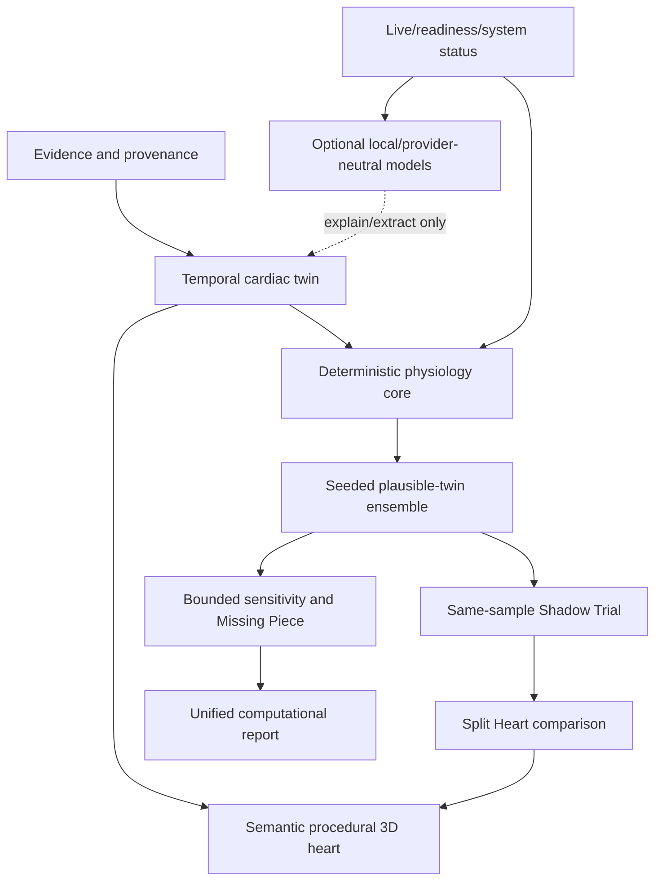

# BeatIT Final Architecture

## Authority boundaries

- Python deterministic physiology is the authority for numerical outputs.
- M5.5 ensemble, M6 Shadow Trial, and M8 Missing Piece contracts remain
  versioned and backend-authoritative.
- Next.js composes state and renders visualizations; it does not reimplement
  physiology or silently repair persisted results.
- Local model/runtime calls explain, extract, or summarize only. They never
  calculate cardiac physiology.
- VISTA-3D is optional imaging infrastructure and is not required for startup
  or the procedural demo heart.

## Self-host boundary

FastAPI and Next.js bind to loopback under `deploy/beatit`; nginx/Caddy handles
public routing, TLS, payload limits, compression, and SSE buffering. PostgreSQL,
Valkey, and artifact storage are external dependencies only when explicitly
configured. The current local SQLite/file-backed stores must not be described as
an authenticated multi-user clinical data platform.
