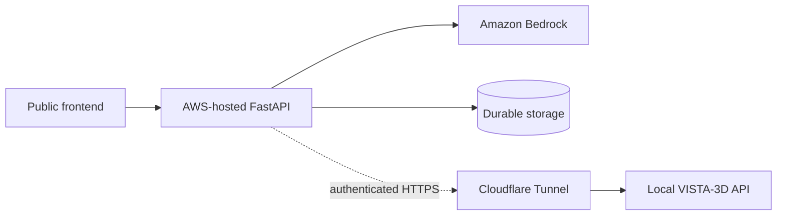

# AWS architecture and deployment truth

## Current state

BeatIT is **not hosted on AWS**.

The 2026-09-26 deployment campaign authenticated successfully to AWS account
`107171643295` as the workshop role recorded in
`docs/deploy/AWS_DEPLOYMENT_AUDIT.md`. Service probes showed that the role could
not use any viable hosting path. No ECR repository, ECS cluster/service,
App Runner service, Amplify application, EC2 instance, Lambda function,
Lightsail instance, S3 bucket, secret, parameter, or CloudFormation stack was
created for BeatIT.

There are therefore:

- no AWS frontend or backend deployment;
- no AWS public application URL;
- no AWS-to-Cloudflare-to-VISTA production path;
- no AWS-hosted persistence;
- no AWS deployment billing footprint identified beyond the model smoke call.

## What actually worked

Amazon Bedrock model/profile discovery and a minimal runtime inference succeeded
in `us-east-1`. The recorded smoke used `nvidia.nemotron-nano-12b-v2` and
returned the expected marker. This is evidence of Bedrock access, not evidence
that BeatIT was deployed or that its complete Copilot workflow was certified on
AWS.

CloudWatch Logs read access also succeeded during probing, but BeatIT did not
create a log group or emit hosted application logs.

## Implemented AWS-capable code

The repository contains optional AWS integration code:

- `python/hearttwin/intelligence/openai_provider.py` implements a Bedrock
  OpenAI-compatible provider.
- `python/hearttwin/intelligence/bedrock/` contains Bedrock runtime helpers.
- `python/hearttwin/storage/s3.py` implements an optional S3 artifact store.
- `python/hearttwin/storage/factory.py` selects S3 only when explicitly enabled.
- `pyproject.toml` exposes `boto3` as the optional `aws` dependency.

These are capabilities, not deployed resources.

## Failed target path

The campaign evaluated Amplify, App Runner, ECS/Fargate, EC2, Lambda, and
Lightsail. IAM denied the read probes needed to establish or operate each path.
The frontend also uses Next.js 16.2.7, while the campaign's reviewed Amplify
support material covered Next.js through version 15.

No architecture was selected after those gates failed. In particular, it would
be false to describe the current system as:

```text
Vercel frontend -> AWS backend -> Bedrock/VISTA
```

The Vercel attempt failed and the AWS backend does not exist. A temporary
Cloudflare Quick Tunnel now exposes a local BeatIT backend for demonstration;
it is not an AWS deployment or stable production infrastructure.

## Required shape if deployment is retried

This is a conditional design, not current infrastructure:



A retry needs a principal authorized for one hosting service, its artifact/image
source, runtime logs, runtime secrets, and any chosen durable storage. The
backend must also receive exact CORS origins and a durable location for its
SQLite-backed experiment records or replace those stores deliberately.

## Evidence

The authoritative campaign records are:

- `docs/deploy/AWS_DEPLOYMENT_AUDIT.md`
- `docs/deploy/AWS_FINAL_REPORT.md`
- `docs/deploy/AWS_RESOURCES.md`
- `docs/deploy/AWS_SECURITY.md`

This document does not convert optional code or an IAM probe into a deployment
claim.
