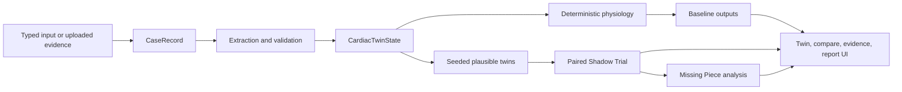

# BeatIT data flow

## Core case flow



1. `POST /api/v1/cases` creates the case.
2. Upload and extraction routes collect supported evidence and validate it.
3. The state builder produces `CardiacTwinState` with source metadata.
4. deterministic electrophysiology, hemodynamics, findings, and bounded recovery
   tools produce canonical numerical outputs.
5. Seeded distributions vary uncertain inputs and re-run deterministic
   calculations to form plausible twins.
6. Shadow Trial pairs each baseline sample with its own scenario descendant;
   it does not resample the counterfactual arm.
7. Missing Piece summarizes uncertainty drivers and evidence value. Its output
   is evidence prioritization, not a recommendation to order a test.

## Status and provenance

Values must preserve their epistemic status:

```text
supplied evidence
  -> extracted/measured values
  -> inferred or prior-filled inputs
  -> deterministic derived values
  -> hypothetical simulated values
```

`CardiacTwinState.source_map`, ensemble provenance, Shadow Trial provenance, and
assistant provenance mappings retain this lineage. A language model receives
selected computed context but does not promote inferred or simulated data into
observed evidence.

## Assistant flow


When the language provider is absent or fails, the assistant has deterministic
fallback responses. Bedrock's successful standalone smoke does not establish a
deployed end-to-end assistant path.

## Imaging flow

```mermaid
flowchart LR
    Upload[CT bytes]
    Client[VISTA client]
    Health[Authenticated health probe]
    Submit[Segmentation job submission]
    LocalGPU[Local VISTA-3D GPU service]
    Mask[Segmentation mask and metadata]
    Volume[Deterministic mask analysis]
    State[Imaging provenance in twin state]

    Upload --> Client
    Client --> Health
    Health --> Submit
    Submit --> LocalGPU
    LocalGPU --> Mask
    Mask --> Volume
    Volume --> State
```



The client is environment-gated and returns explicit `disabled`,
`unavailable`, or `failed` states. It does not fabricate segmentation output.
The active Cloudflare Quick Tunnel exposes the local BeatIT backend, not VISTA
directly. VISTA remains a local/optional flow and its API is not a public route.

## Storage flow

- Local artifacts are the default.
- Redis is optional for case/memory behavior.
- Ensemble, Shadow Trial, and Missing Piece persistence is SQLite-backed.
- S3 is an optional artifact adapter and has not been deployed.
- No database or object store was provisioned on AWS.

## Data boundaries

The API should receive controlled uploads, not arbitrary client-provided local
filesystem paths. Raw uploads and patient payloads must not be sent to logs or
language-model providers. Synthetic, open, and restricted datasets remain
distinct; the failed deployment uploaded none of them.
