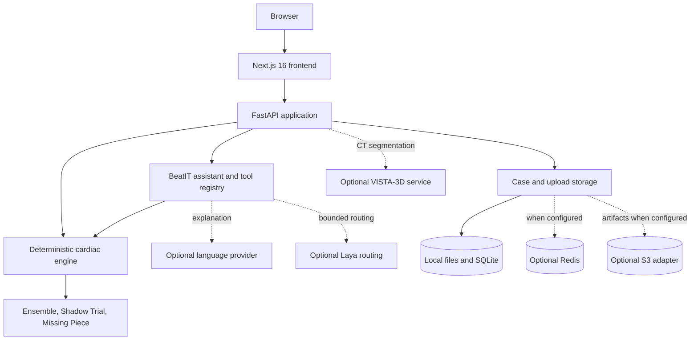

# BeatIT system architecture

## Status at a glance

BeatIT is implemented as a Next.js frontend and a FastAPI backend. The
deterministic Python cardiac engine is the numerical authority. External model
providers are optional explanation, routing, and image-segmentation
integrations.

This repository does **not** contain evidence of a successful public
deployment:

- AWS hosting failed at the permission-probe stage; no AWS hosting resources or
  public AWS URLs exist.
- Amazon Bedrock model discovery and one minimal inference smoke test did
  succeed in `us-east-1`.
- A Vercel deployment was attempted and failed. Local Vercel project metadata
  exists, but there is no verified successful deployment or public URL.
- A Cloudflare Quick Tunnel currently exposes the loopback-bound BeatIT backend
  as a temporary demo bridge. The backend and tunnel are detached processes
  recorded under ignored `.run/beatit/` state. This is not a durable deployment
  and its hostname changes when the tunnel restarts.

These are different facts: a configured adapter or deployment manifest is not
evidence that its external service is running.

## Runtime components

The diagram describes implemented interfaces, not deployed infrastructure.
Dashed edges are optional and must degrade honestly when unavailable.

## Frontend

The frontend is under `web/` and uses Next.js 16.2.7, React 19, TypeScript,
React Three Fiber/Three.js, Plotly, and Zustand. Product routes and
components cover case intake, twin exploration, experiments, comparisons,
provenance, reports, traces, and assistant interactions.

`web/lib/api.ts` and related clients call the FastAPI contract. A production
frontend must be configured with the real backend origin; repository Vercel
configuration alone does not provide one.

## Backend

`python/hearttwin/api.py` owns the FastAPI application. `api/index.py` only
re-exports that application for a serverless entry point. Principal route
families include:

- case creation, uploads, extraction, operation, and bounded recovery;
- deterministic system, model, intelligence, and storage status;
- seeded plausible-twin ensembles;
- paired Shadow Trials;
- Missing Piece uncertainty and evidence-ranking analyses;
- the canonical assistant router and tool registry;
- trace retrieval and server-sent trace updates.

The API currently has wildcard CORS with credentials enabled. The AWS audit
correctly records this as a public-release blocker; it is implementation
configuration, not proof of a deployed service.

## Numerical authority

Canonical physiology is computed in Python, especially:

- `python/hearttwin/tools/cardiac_state.py`
- `python/hearttwin/tools/hemodynamics.py`
- `python/hearttwin/tools/recovery_sim.py`
- `python/hearttwin/ensemble.py`
- `python/hearttwin/shadow_trial_engine.py`
- `python/hearttwin/missing_piece/`

Language models may explain already-computed values. They may not replace,
silently alter, or invent canonical cardiac calculations.

## Persistence

The default runtime is local:

- case state and uploads use the configured storage abstraction, with local and
  optional Redis paths;
- artifacts default to `data/artifacts`;
- ensemble, Shadow Trial, and Missing Piece records use local SQLite files.

An S3 artifact adapter exists but is selected only when `AWS_ENABLED=true` and
an S3 bucket is configured. No deployed bucket exists according to the AWS
audit. Local SQLite also requires a durable mounted filesystem to be suitable
for a hosted runtime.

## External integrations

| Integration | Implementation | Current evidence |
| --- | --- | --- |
| Amazon Bedrock | OpenAI-compatible and Bedrock-specific provider paths | Actual discovery and minimal smoke inference passed; no hosted BeatIT runtime |
| OpenAI-compatible providers | Optional provider factory | Implemented; availability depends on private runtime configuration |
| Laya | Bounded routing adapter with deterministic fallback | Implemented; source states Laya is not reachable in the audited environment |
| VISTA-3D | Optional authenticated HTTP client and local runner boundary | Implemented; no current public bridge |
| Cloudflare Tunnel | Named-tunnel scripts; active Quick Tunnel to local backend | Temporary endpoint; not durable infrastructure |
| Vercel | Root Python and `web/` Next.js manifests | Attempt failed; no successful URL |
| Redis | Optional case/memory path | Implemented, not established as deployed |
| Weave | Optional tracing integration | Implemented, not established as deployed |

## Safety and scope

BeatIT is an educational and research simulation for clinician-supervised
communication. It is not a diagnostic system, treatment recommender, emergency
service, clinically validated outcome predictor, or medical device.

The system preserves deterministic operation when optional model or imaging
providers fail. Simulated values and uncertainty summaries must remain
distinguishable from supplied evidence and derived values.

## Evidence used for this document

- runtime manifests: `package.json`, `web/package.json`, `pyproject.toml`;
- runtime entry points: `python/hearttwin/api.py`, `api/index.py`;
- engine, assistant, storage, and VISTA source under `python/hearttwin/`;
- deployment manifests: `vercel.json`, `web/vercel.json`;
- audited deployment records under `docs/deploy/`;
- local process and deployment-metadata inspection on 2026-09-26.
