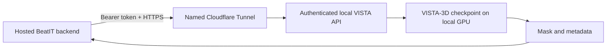

# VISTA-3D integration

## Current deployment truth

VISTA-3D remains a local, optional integration. It is not hosted on AWS.

An active Cloudflare Quick Tunnel exposes the BeatIT backend only. It does not
route directly to VISTA. The tunnel, backend, VISTA API, and two GPU workers run
as detached local processes; PID, URL, and logs are ignored runtime state. A
Quick Tunnel must not be described as production infrastructure.

A fresh local automatic segmentation completed on GPU 0 in 0.257 seconds on
2026-09-26, proving the local API-to-worker-to-model path independently of AWS.

The earlier checked-in security audit also records that the then-running local
VISTA API did not enforce its endpoint secret, so it was not eligible for a
certified public bridge. No current AWS-to-VISTA E2E path has been proven.

## Implemented contracts

BeatIT has two related boundaries:

- `python/hearttwin/imaging/vista3d.py` accepts a local framework-specific runner
  and checkpoint path and fails closed when either is unavailable.
- `python/hearttwin/tools/vista3d_client.py` implements the optional HTTP job
  client used by extraction.

The HTTP client is enabled only when `VISTA3D_ENABLED=true` and
`VISTA3D_API_BASE` is set. It supports bearer authentication from
`VISTA3D_API_KEY`/`VISTA3D_ENDPOINT_SECRET`, probes `/health`, and submits CT
bytes to `/api/v1/segment`.

The current client contract expects asynchronous job URLs. It can poll status,
retrieve metadata and the result mask, then pass the mask to deterministic
volumetry. It does not accept a caller-supplied path as a remote inference
contract.

## Intended secure bridge

This diagram is a target boundary, not current deployment evidence.
`cloudflared` should make outbound connections from the GPU host and expose only
the VISTA API. It must not expose SSH, the filesystem, checkpoint directories,
or arbitrary local services.

## Required security gates before reuse

- enforce a strong endpoint secret and verify unauthenticated requests receive
  `401` or `403`;
- restrict request methods, content types, upload size, concurrency, and
  inference duration;
- accept controlled upload bytes, never arbitrary local filesystem paths;
- restrict CORS and callback/redirect behavior;
- keep the service token only in server-side runtime configuration;
- avoid patient payloads, tokens, and local paths in logs;
- verify live, ready, authenticated inference, timeout, and outage behavior
  through the public hostname.

Tunnel connectivity alone is not proof of inference.

## Graceful degradation

If VISTA or the tunnel is unavailable, the client returns a labeled disabled,
unavailable, or failed result and invents no image findings. Core case,
deterministic physiology, scenario, comparison, evidence, and reporting paths
must remain usable. The UI may use procedural/semantic heart geometry, clearly
distinguished from patient-specific segmentation.

## Model limitations represented in code

The client currently maps VISTA-3D's verified heart output to a single heart
label (`115`); separate chamber and myocardium masks are not claimed.
Pulmonary-artery requests use the documented pulmonary-vein proxy with an
explicit warning. These mappings are segmentation metadata, not clinical
measurements.
