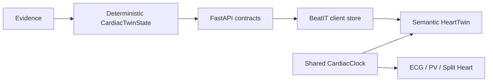

# BeatIT architecture

BeatIT keeps DualBeat's deterministic backend physiology, provenance, safety gates, and API contracts as the research lineage. The product name is BeatIT; the internal Python package remains `hearttwin` to avoid a risky backend rename in M1.

The frontend's semantic registry is deliberately data-oriented. It maps stable anatomy IDs to geometry hints and backend bindings; it does not calculate EF, cardiac output, QTc, or PV loops. Numeric physiology remains deterministic and separate from language-model explanations.

M1 exposes the foundational model and shared timing primitive. Streaming, causal manipulation, probabilistic sampling, shadow trials, comparison, and evidence ranking remain future work.
