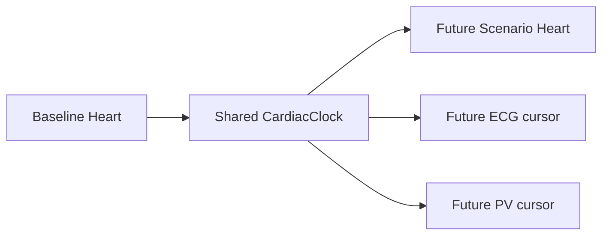

# Shared cardiac clock

`web/lib/heart/clock.ts` provides a deterministic, imperative `CardiacClock`. It stores heart rate, cycle duration, elapsed time, normalized phase, named cardiac phase, and play state. `advance(deltaMs)` is the only progression operation; tests and future playback can drive it without wall-clock access.

The visual phase partition is documented and bounded: atrial systole (0–0.15), ventricular filling (0.15–0.42), isovolumetric contraction (0.42–0.50), ventricular ejection (0.50–0.78), and isovolumetric relaxation (0.78–1.0). The ranges are visualization timing boundaries, not a replacement for backend physiology.

The M1 3D body and blood-flow layer consume one clock instance, preventing animation drift. `setHeartRate` clamps visual timing to 20–260 BPM while preserving backend values; invalid visual inputs fall back to 72 BPM. `play`, `pause`, `reset`, `seek`, and subscriptions are deterministic and testable.
