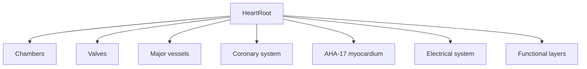

# Semantic heart component model

`web/lib/heart/registry.ts` is the single source of truth for addressable cardiac components. It currently includes chambers, valves, major vessels, coronary arteries, all 17 AHA myocardial segments, electrical structures, and functional visualization layers.

Each definition has a stable ID, category, anatomy description, geometry/fallback region, physiology/evidence/finding bindings, and capability flags for selection, hover, focus, uncertainty, and difference mode. AHA IDs are `aha-01` through `aha-17`; coronary territory metadata is preserved as LAD, LCX, or RCA.

Renderers consume registry entries rather than scattering mesh-name conditionals. The current procedural heart remains a practical geometry fallback; future GLTF meshes can populate `geometry.meshNames` without changing the data contract. Animation ownership belongs to the shared clock and functional layers. Uncertainty and split-heart flags are present as capabilities but are not presented as implemented features in M1.
