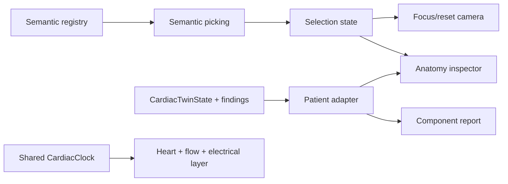

# BeatIT M2 architecture

M2 adds an interaction boundary around the M1 semantic registry without replacing the procedural heart geometry. `SemanticPickLayer` provides deterministic proxy hit regions with stable `heartComponentId` metadata. React interaction state resolves those IDs into camera focus, inspector, evidence, and report views.

The adapter accepts state as an argument, not a singleton, so M3 snapshots and M7 baseline/scenario instances can reuse it. Generic anatomy is rendered separately from patient-bound state. Missing evidence is explicit.
