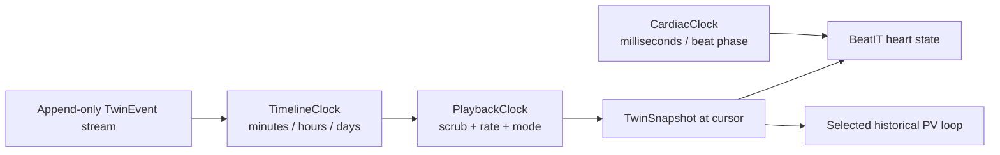

# BeatIT M3 temporal model

M3 adds history time to the M2 snapshot renderer. The model keeps two clocks
separate:

## Time contracts

`TwinTimestamp` is an ISO-8601 timestamp normalized to UTC with millisecond
precision (`YYYY-MM-DDTHH:mm:ss.sssZ`). Input may be an ISO string with an
explicit timezone, a `Date`, or epoch milliseconds. Date-only strings and
timezone-less strings are rejected at the ingestion boundary; silently
guessing a local timezone would make a replay differ between machines.

`normalizeTwinTimestamp` is the single normalization function. It validates
the input and returns a canonical UTC value. `compareTwinTimestamps` compares
the resulting instants, not their original timezone spellings.

## Event ordering and immutability

Events are append-only records. A correction is a new event with its own ID and
provenance; existing events are never edited. `sortTwinEvents` returns a new
array and applies this deterministic order:

1. normalized event timestamp;
2. event ID;
3. event type;
4. event source;
5. stable serialization of payload and provenance;
6. original input position only when every exposed field is identical.

The final position tie-breaker preserves duplicate records without inventing a
second identity. Event-store code is responsible for its duplicate-ID policy;
the temporal contract does not silently discard evidence.

Snapshots are serializable projections of a state at a timestamp. Their state,
changed-field log, evidence IDs, quality, and provenance travel together so a
historical selection can be explained without consulting mutable UI state.

## The two history primitives

`TimelineClock` owns only a bounded historical cursor. Its `advance(deltaMs)`
method accepts explicit milliseconds and clamps at the configured end. It has
no interval, animation frame, wall-clock read, or heart-rate behavior.

`PlaybackClock` owns playback mode (`live`, `paused`, `playing`, or
`scrubbing`), selected snapshot ID, and one of the supported rates (`0.5x`,
`1x`, `2x`, `5x`, `10x`). It wraps a `TimelineClock`; `advance(realDeltaMs)`
multiplies the explicit delta by the selected rate only while playing. It
transitions to `live` at the timeline end and supports deterministic
`seek`, `scrubTo`, `jumpToLive`, and subscriptions. It never creates a timer.

`CardiacClock` in `web/lib/heart/clock.ts` remains unchanged. It continues to
advance the visual cardiac cycle in milliseconds and controls beat phase only.
History playback may move from one longitudinal snapshot to another while the
cardiac clock continues to beat. A selected historical snapshot chooses the
heart state, findings, PV/ECG context, and evidence; `CardiacClock` chooses the
within-beat animation phase.

## Boundary policy

- `LIVE` means the latest available twin state, not a claimed medical-device
  connection.
- Synthetic/replayed inputs must carry `synthetic_replay` provenance and be
  labelled `REPLAY` or `DEMO STREAM` in the UI.
- Historical reconstruction is deterministic and explicit. No language model
  or wall-clock timer computes physiology.
- Interpolation is conservative: visual heart rate may be interpolated by a
  later adapter when explicitly marked; echo EF and discrete AHA findings are
  held at the last observed value unless a simulation event says otherwise.
- An event timestamp carries its source time. Normalizing to UTC changes the
  representation, not the instant.
