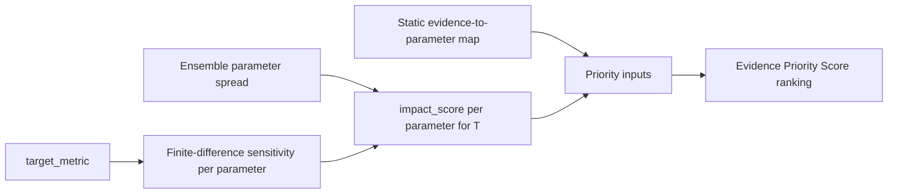

# M8 Experimental Design Review — Circular Reasoning & Target Specificity

Date: 2026-09-26  
Reviewer role: Agent 33 — Experimental Design Reviewer  
Scope: `evidence_value.py`, `evidence_map.py`, `impact.py`, `engine.py` (orchestration
only for how evidence ranking is wired), plus supporting taxonomy in `evidence.py`
and completeness in `completeness.py` where the engine invokes it.

Read-only adversarial review. **No code was changed.**

## Question under test

When a user selects a **target metric** and M8 ranks evidence types, does each
recommendation **independently** address parameters that (a) are **mapped** by
that evidence in the reviewed taxonomy and (b) **actually drive uncertainty** in
that target under the stated heuristic—without circularly re-labeling “important
parameters” as “get the evidence we already said maps to important parameters”
in a way that **misrepresents** target-specific experimental value?

## Data flow (audit spine)

The ranking is **not** information gain or expected uncertainty reduction; it is
a transparent weighted sum documented in `evidence_value.py` and `evidence_map.py`.

## Executive verdict

**CONDITIONAL PASS with material FAIL findings on target-specific experimental
design and presentation.**

The pipeline **does** filter uncertainty impacts by `target_metric` before scoring
evidence, so rankings **change** when the target changes and cross-metric impact
rows are ignored. That breaks the strongest form of circular reasoning (reusing
another metric’s drivers). However, the **evidence taxonomy is global** (not
target-conditioned), completeness is **not** tied to dominant drivers for the
selected target, and ranked outputs can **list parameters with zero target
contribution** as if they were constrained for priority purposes. Presenting the
ranking as “what experiment to run next for this target” without those caveats
would be **misleading**.

---

## Findings

| ID | Area | Result | Finding and evidence |
|---|---|---|---|
| ED-1 | Impact gating by target | **PASS** | `build_priority_inputs` / `_impact_by_parameter` skip impact rows whose `metric_id` ≠ `target_metric` (`evidence_map.py:96-97`). `build_uncertainty_impacts` only combines sensitivity and spread for the requested `metric_id` (`impact.py:37-38`). The engine passes the same `target_metric` into sensitivity, impacts, and `rank_evidence` (`engine.py:212-240`, `339-342`). Focused tests confirm non-target impacts do not affect scores (`test_missing_piece_evidence_map.py:46-52`, `test_missing_piece_evidence_value.py:36-37`). |
| ED-2 | Independent evidence→parameter axis | **PASS (design intent)** | Parameter links come from a **fixed, versioned allowlist** (`EVIDENCE_PARAMETER_MAPPINGS` in `evidence_map.py:22-34`) validated against taxonomy declarations (`evidence.py:39-61`, `mapped_parameters` in `evidence_map.py:53-77`). Strength weights are separate from impact (`STRENGTH_WEIGHTS`). The score is explicitly **not** derived from re-reading sensitivity inside the map layer (`evidence_map.py:152-154`, `evidence_value.py:24-28`). |
| ED-3 | Derivative tautology (ranking algebra) | **PASS with disclosure requirement** | By definition, `contribution = impact_score × strength_weight` (`evidence_map.py:138-139`). High-ranked evidence **must** overlap high-impact parameters for that target. That is algebraically tautological but **not** a hidden loop: impact is computed before the map is applied, and docs/assumptions state the method is an Evidence Priority Score, not optimal design (`evidence_value.py:52-56`, engine limitations `engine.py:265-269`). **Fail the product claim**, not the math, if UI copy implies VOIA/Bayesian optimality. |
| ED-4 | Uncertainty leg independent of target sensitivity | **PASS** | `parameter_uncertainty` is ensemble-wide spread (`uncertainty.py:32-40`); impact multiplies spread × **target-specific** normalized response (`impact.py:55-63`). A parameter with large spread but negligible sensitivity to the chosen target receives ~zero impact and cannot inflate evidence rank—avoiding “recommend evidence for irrelevant uncertainty.” |
| ED-5 | Static evidence map vs target-specific identifiability | **FAIL** | The same three evidence types and parameter sets apply to all seven supported targets (`evidence.py:39-61`, `engine.py:58-67`). There is no target-conditioned map (e.g., volume-specific modalities for `edv_ml` / `esv_ml`, or pressure-first mapping when `target_metric == map_mmhg`). Target specificity enters **only** through which impacts are large, not through which observations are **a priori** identifiable for that endpoint. Experimental design therefore **under-specifies** target-appropriate acquisition strategies. |
| ED-6 | Completeness vs dominant drivers | **FAIL** | `assess_completeness` is keyed by caller-supplied `parameter_ids` (`completeness.py:10-27`). The engine passes **all** `PARAMETER_BOUNDS` keys, not `dominant_uncertainty_drivers` or a target-filtered subset (`engine.py:241-245`). Completeness records `target_metric` but coverage logic is unchanged across targets (`completeness.py:56-58`). A user can see `declared_complete: true` while the **top uncertainty drivers for that target** remain unaddressed by any ranked evidence overlap check. |
| ED-7 | Zero-impact parameters in ranked outputs | **FAIL** | `build_priority_inputs` emits a row for every mapped parameter with `impact_score` defaulting to `0.0` when absent (`evidence_map.py:128-129`). `rank_evidence` sets `constrained_parameters` to **all** priority input parameter IDs (`evidence_value.py:49`), including zero-contribution rows. Consumers can misread “constrained_parameters” as “parameters this evidence would meaningfully reduce for this target’s ranking score,” which is **stronger** than what the score used. |
| ED-8 | Shadow Trial effect path shares baseline evidence map | **FAIL (target-kind gap)** | `run_missing_piece_shadow_effect` recomputes target-specific effect sensitivities but reuses the **same** static `evidence_constraints()` and `rank_evidence` path (`engine.py:339-342`). Effect uncertainty drivers (paired delta on a fixed scenario) can diverge from baseline-output drivers; the evidence taxonomy does not distinguish **effect** vs **output** experimental value. Reusing baseline proxy mappings without a target-kind-aware map risks **false target-specificity** for M6-style questions. |
| ED-9 | Multi-parameter evidence and collinearity | **FAIL (design limitation)** | `echocardiographic_measurement` sums contributions from `preload_index` and `contractility_index` (`evidence_map.py:24-27`, aggregation in `map_evidence_scores`). One acquisition type double-counts two drivers with no orthogonality or experimental confound control. Acceptable for a hackathon heuristic; **invalid** as a sequential experiment planner without explicit dependence assumptions. |
| ED-10 | No feedback from “recommended evidence” to uncertainty | **PASS** | Ranking does not update ensemble spread or sensitivities. `available_evidence_types` affects completeness availability only (`completeness.py:39-40`, `engine.py:244-245`). No circular **inference** loop where recommended evidence re-enters the impact calculation in the same run. |
| ED-11 | `estimated_reduction` always unset | **PASS** | `rank_evidence` sets `estimated_reduction=None` (`evidence_value.py:50`), avoiding fabricated expected variance reduction that would circularly **assume** the proxy map is correct. |
| ED-12 | Parameter / target homonym (`heart_rate_bpm`) | **PASS with audit note** | When the target **is** `heart_rate_bpm`, drivers and `repeat_ecg` mapping align on the same proxy (`evidence.py:55-59`). This is coherent, not circular, because sensitivity and map are independently defined; document that this case is **structurally easy** to rank correctly and should not be used alone to validate general target specificity. |

---

## Circular-reasoning attack summary

| Attack | Outcome |
|---|---|
| “Rank evidence using impacts computed for a **different** metric” | **Blocked** — metric filter on impacts (ED-1). |
| “Treat mapping weights as if they were measured information gain” | **Blocked in code** — method strings and assumptions (ED-2, ED-3, ED-11); **blocked in product only if copy is disciplined**. |
| “Recommend evidence because we already decided those parameters matter” | **Partially true by construction** — EPS is impact-weighted (ED-3); not a fallacy if labeled a priority heuristic, **misleading** if sold as independent experimental design. |
| “Declare completeness for the target using drivers that weren’t used to rank” | **Fails** — completeness uses full parameter bounds (ED-6). |
| “Same evidence menu optimizes every cardiac endpoint” | **Fails** — global taxonomy (ED-5, ED-8). |

---

## Target-specificity scorecard

| Criterion | Pass? |
|---|---|
| Sensitivity computed for selected `target_metric` | Yes |
| Impact scores use only that metric’s sensitivities | Yes |
| Evidence scores use only that metric’s impacts | Yes |
| Evidence types / modalities vary by target | **No** |
| Completeness tied to target’s dominant drivers | **No** |
| Shadow effect uses effect-aware evidence mapping | **No** |
| Rank output lists only parameters with nonzero contribution | **No** |

---

## Gate disposition

**Experimental-design gate: FAIL until presentation and completeness gaps are
closed or explicitly bounded in the M8 product contract.**

Minimum acceptable mitigations (documentation or schema; no requirement to
implement full Bayesian design in hackathon scope):

1. **Narrow `constrained_parameters` on ranked rows** to parameters with
   nonzero contribution for the stated target, or add a parallel field
   `contributing_parameters` vs `reviewed_map_parameters`.
2. **Document** that evidence types are global educational proxies, not
   target-optimal study protocols (extend engine/API limitations already
   partially present at `engine.py:265-269`).
3. **Wire completeness** to the same parameter set used for ranking (e.g.,
   parameters with positive `impact_score` or top-k drivers), or rename
   completeness to “full-model proxy coverage” to avoid implying target closure.
4. For Shadow Trial effect analysis, **either** supply a target-kind-aware map
   **or** forbid interpreting baseline evidence rankings on effect results.

---

## Regression anchors (existing tests)

- Target-filtered impacts: `test_missing_piece_evidence_map.py` (`target_metric="ef"` ignores `metric_id="other"`).
- Ranked scores: `test_missing_piece_evidence_value.py` (multi-parameter echo vs ECG ordering for synthetic impacts).
- Unsupported cross-map parameters rejected: `test_rank_evidence_uses_only_reviewed_parameters`.

These tests **guard metric filtering and map integrity**; they do **not** assert
target-optimal experimental design or driver-aligned completeness.
